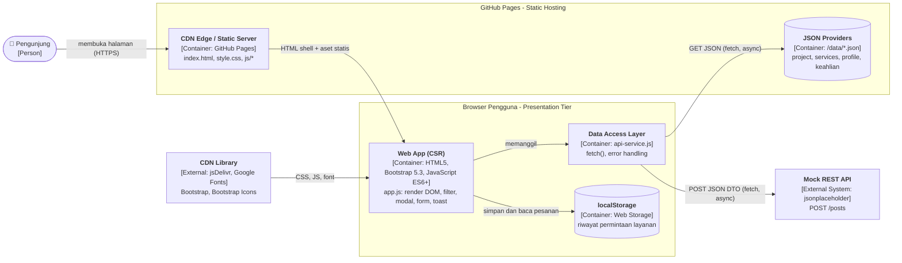

# Praktikum Minggu 4 - Refactoring Arsitektural Personal Portfolio & Service Portal

**Mata Kuliah:** Pemrograman dan Pengujian Web (12S3101) - Institut Teknologi Del
**Nama:** Theresia Oktaviani Samosir | **NIM:** 12S24055 | **Kelas:** 13SI2
**Live Demo (GitHub Pages):** `https://<username>.github.io/<nama-repositori>/` <!-- TODO: ganti setelah deploy -->
**Branch:** `week4-architecture`

Proyek ini melanjutkan portofolio Minggu 3 (Bootstrap 5.3). Seluruh konten yang semula ditulis langsung di `index.html` dipindahkan ke penyedia data JSON terpisah dan dirender secara dinamis di browser (Client-Side Rendering).

---

## 1. Struktur Direktori

```
Praktikum Week 4/
├── index.html            # Shell HTML5 + Bootstrap 5, tanpa kartu hardcoded
├── style.css             # Custom styles, tema, dan CSS variables
├── theresia-profile.jpeg # Foto profil
├── js/
│   ├── api-service.js    # Data Access Layer: fetch, error handling, mock POST
│   └── app.js            # Presentation Layer: DOM, rendering, event, modal, form
└── data/
    ├── profile.json      # Biodata dan info cepat
    ├── project.json      # 8 proyek (kategori, tags, metrics, link)
    ├── services.json     # 3 paket layanan (fitur dan tarif)
    └── keahlian.json     # 7 keahlian utama
```

---

## 2. Diagram Arsitektur (C4 Container Model)



**Keterangan lapisan (Multi-Tier):**

| Tier | Komponen | Tanggung jawab |
|---|---|---|
| Presentation Tier | `index.html`, `style.css`, `app.js` | Antarmuka, rendering DOM, interaksi, UI states, Toast |
| Application / API Logic Tier | `api-service.js`, Mock REST API | Kontrak pengambilan dan pengiriman data, penanganan error HTTP |
| Data Storage Tier | `/data/*.json`, `localStorage` | Penyimpanan data statis (JSON) dan persistensi sisi klien |

---

## 3. Separation of Concerns (SoC)

Pada Minggu 3, struktur halaman, isi data, dan tampilan bercampur dalam satu berkas `index.html`. Setiap perubahan konten (misalnya menambah proyek) menuntut penyuntingan markup HTML. Pada Minggu 4 tanggung jawab dipisahkan menjadi empat lapisan yang masing-masing hanya memiliki satu alasan untuk berubah:

1. **Struktur (HTML):** `index.html` hanya berisi kerangka dan penampung kosong (`#projectGrid`, `#servicesCatalog`, `#skillsList`). Tidak ada konten data di dalamnya.
2. **Data (JSON):** isi portofolio berada di `/data`. Menambah proyek cukup menambah satu objek JSON tanpa menyentuh HTML atau JavaScript.
3. **Akses data (`api-service.js`):** satu-satunya berkas yang memanggil `fetch`. Berkas ini tidak menyentuh DOM, sehingga sumber data dapat diganti (misalnya dari file JSON ke REST API sungguhan) tanpa mengubah logika tampilan.
4. **Presentasi (`app.js`):** menerima data dari `ApiService` lalu merakit DOM, mengelola filter, modal, form, dan state tampilan.

Pemisahan ini menyerupai pola Jamstack: aset statis disajikan dari CDN, sedangkan data dimuat secara asinkron lewat API pada saat halaman berjalan. Hasilnya, pemeliharaan lebih mudah, setiap lapisan dapat diuji sendiri, dan TTFB halaman tetap rendah karena server hanya mengirim HTML shell kecil.

### Perbandingan paradigma rendering

| Parameter | SSR | CSR (proyek ini) | Jamstack |
|---|---|---|---|
| Perakitan DOM | Di server per request | Di browser via JavaScript | Build-time dan hydrate via API |
| Beban server | Tinggi | Sangat rendah | Minimal (CDN) |
| TTFB | Menengah-lambat | Cepat (HTML shell kecil) | Sangat cepat (cache CDN) |
| Hosting | Server aktif 24/7 | Static CDN (GitHub Pages) | Static CDN + serverless |

---

## 4. Fitur yang Diimplementasikan

- **Dynamic CSR dan 4 UI States:** loading (skeleton), success (kartu), empty (hasil filter kosong), dan error (alert dengan tombol "Coba Lagi").
- **Filter kategori dan pencarian instan** pada portofolio, dengan penomoran proyek yang tetap.
- **Universal Dynamic Modal:** satu elemen modal untuk semua proyek, isinya diinjeksi berdasarkan ID proyek.
- **Katalog layanan dinamis** dari `services.json`; tombol "Pilih Layanan Ini" mencentang jenis layanan pada form.
- **Form asinkron:** `fetch` POST dengan payload JSON, tanpa reload, tombol berubah menjadi "Mengirim...", umpan balik Bootstrap Toast.
- **State lokal:** pesanan disimpan di `localStorage` dan jumlahnya tampil pada badge "Pesanan" di navbar secara reaktif.
- **Keamanan sisi klien:** `escapeHTML()` untuk semua nilai dinamis, `safeUrl()` yang hanya mengizinkan `http`/`https`/relatif, `safeIcon()` yang hanya mengizinkan kelas `bi-*`, serta `textContent` untuk Toast dan elemen profil.

### Rancangan Content Security Policy (CSP)

Direktif yang direkomendasikan untuk situs ini (dapat dipasang lewat meta tag atau header server):

```
default-src 'self';
script-src  'self' https://cdn.jsdelivr.net;
style-src   'self' https://cdn.jsdelivr.net https://fonts.googleapis.com 'unsafe-inline';
font-src    https://fonts.gstatic.com https://cdn.jsdelivr.net;
img-src     'self' data: https:;
connect-src 'self' https://jsonplaceholder.typicode.com;
object-src  'none';
base-uri    'self';
```

Skrip inline telah dihapus dari `index.html` sehingga `script-src` tidak memerlukan `'unsafe-inline'`.

---

## 5. Perbandingan Sebelum vs Sesudah Refactoring

| Aspek | Minggu 3 (Sebelum) | Minggu 4 (Sesudah) |
|---|---|---|
| Sumber konten | Ditulis langsung di `index.html` | Dimuat dari `/data/*.json` |
| Arsitektur | Monolitik statis | Decoupled multi-tier |
| Rendering | Statis di HTML | Dynamic CSR (fetch + async/await) |
| Menambah proyek | Edit HTML | Tambah objek di `project.json` |
| Detail proyek | Modal terpisah per proyek | 1 Universal Dynamic Modal |
| Status antarmuka | Tidak ada | Loading, success, empty, error |
| Filter portofolio | Tidak ada | Filter kategori dan pencarian instan |
| Form layanan | Submit standar (reload halaman) | Fetch POST asinkron + Toast |
| Penyimpanan | Tidak ada | `localStorage` + badge reaktif |
| Keamanan | - | Sanitasi `escapeHTML`, validasi URL, rancangan CSP |

---

## 6. Hasil Profiling Jaringan (Chrome DevTools)

**Kondisi pengujian:** Chrome versi `___`, tab Network, tanpa throttling, pada URL GitHub Pages. <!-- TODO -->
Cold Load = *Disable cache* dicentang + hard reload. Warm Load = muat ulang biasa setelah cold load.

### 6.1 Cold Load vs Warm Load

| Metrik | Cold Load | Warm Load |
|---|---|---|
| TTFB `index.html` | ___ ms | ___ ms |
| First Contentful Paint (FCP) | ___ ms | ___ ms |
| DOMContentLoaded | ___ ms | ___ ms |
| Load | ___ ms | ___ ms |
| Jumlah request | ___ | ___ |
| Data ditransfer | ___ KB | ___ KB |

### 6.2 Analisis Caching (per berkas)

| Berkas | Status Cold | Status Warm | Cache-Control | ETag | Ukuran |
|---|---|---|---|---|---|
| `index.html` | 200 | 304 / 200 (cache) | ___ | ___ | ___ KB |
| `style.css` | 200 | ___ | ___ | ___ | ___ KB |
| `js/app.js` | 200 | ___ | ___ | ___ | ___ KB |
| `js/api-service.js` | 200 | ___ | ___ | ___ | ___ KB |
| `data/project.json` | 200 | ___ | ___ | ___ | ___ KB |
| `data/services.json` | 200 | ___ | ___ | ___ | ___ KB |

### 6.3 Screenshot Waterfall

| Cold Load | Warm Load |
|---|---|
|  |  |

### 6.4 Analisis

<!-- TODO: isi 3-5 kalimat berdasarkan hasil ukur. Contoh poin yang dibahas:
- Mengapa warm load lebih cepat (cache browser / 304 Not Modified, body kosong, hemat bandwidth)
- Urutan request pada waterfall: HTML -> CSS/JS -> JSON (JSON baru diminta setelah app.js berjalan)
- Dampak CSR terhadap FCP: HTML shell kecil sehingga TTFB rendah, tetapi konten kartu baru muncul setelah JSON dimuat
-->

---

## 7. Cara Menjalankan

1. Buka folder proyek di VS Code, jalankan **Live Server** (fetch JSON tidak berjalan jika berkas dibuka langsung lewat `file://`).
2. Buka `http://127.0.0.1:5500/index.html`.

## 8. Git dan Deployment

```bash
git checkout -b week4-architecture
git add .
git commit -m "feat(week4): decouple architecture to json data providers and async CSR"
git push -u origin week4-architecture
```

Aktifkan GitHub Pages: **Settings > Pages > Source: Branch `week4-architecture` > Save**.
