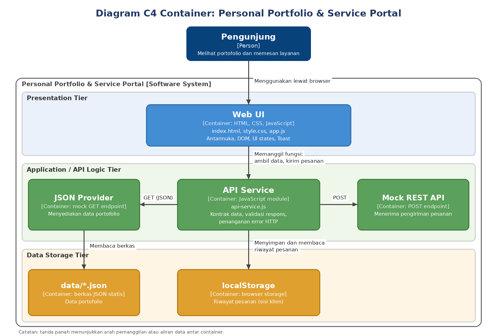
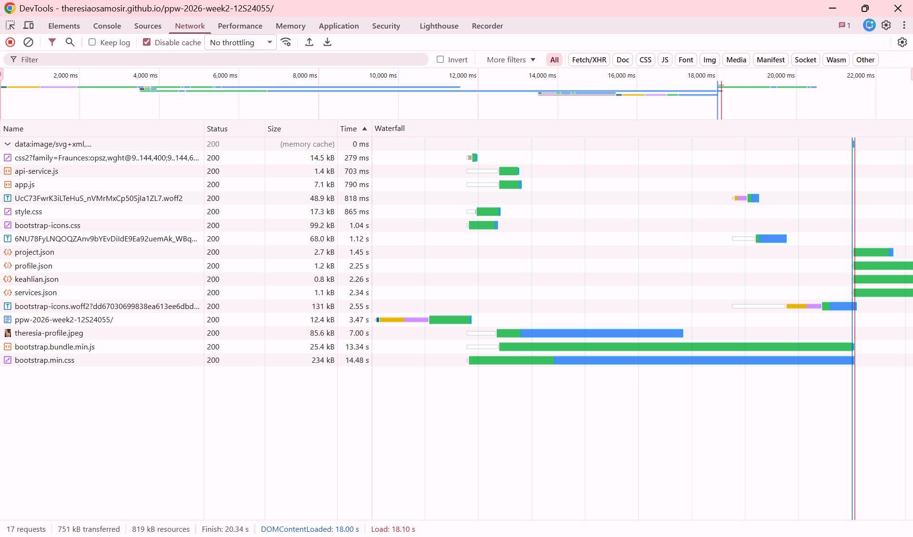
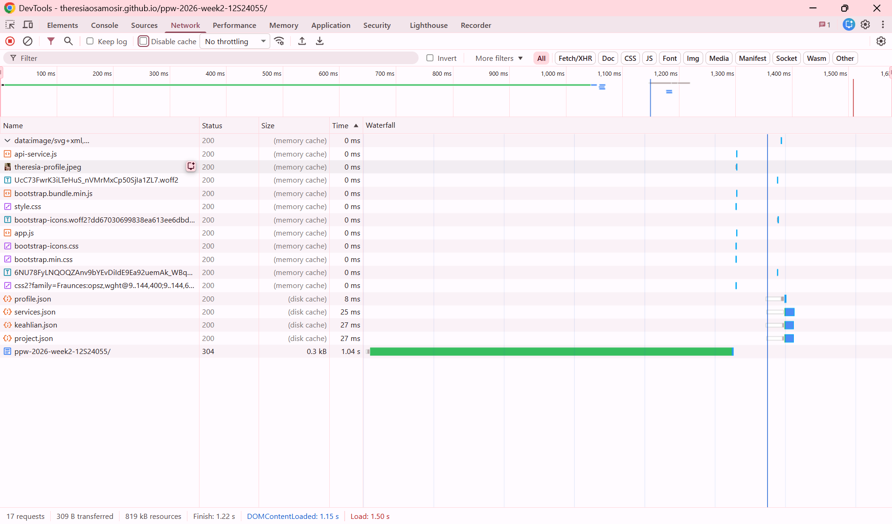

# Praktikum Minggu 4 - Refactoring Arsitektural Personal Portfolio & Service Portal

**Mata Kuliah:** Pemrograman dan Pengujian Web (12S3101) - Institut Teknologi Del
**Nama:** Theresia Oktaviani Samosir | **NIM:** 12S24055 | **Kelas:** 13SI2
**Live Demo (GitHub Pages):** https://theresiaosamosir.github.io/ppw-2026-week2-12S24055/
**Branch:** `PPW-2026-Week4_12S24055`

Proyek ini melanjutkan portofolio Minggu 3 (Bootstrap 5.3). Pada Minggu 3, seluruh kartu, modal, dan katalog layanan ditulis langsung di `index.html` (monolitik statis). Pada Minggu 4, semua isi tersebut dipindahkan ke file JSON terpisah dan dirender oleh JavaScript di browser (Dynamic Client-Side Rendering), sehingga `index.html` hanya menjadi kerangka halaman.

---

## 1. Struktur Direktori

```
ppw-2026-week4-12S24055/
├── index.html              # Shell HTML5 + Bootstrap 5, tanpa kartu hardcoded
├── style.css               # Gaya kustom, tema, CSS variables dari Week 3
├── data/
│   ├── profile.json        # Biodata dan statistik
│   ├── projects.json       # 8 proyek (kategori, tags, metrics, image, link)
│   ├── services.json       # 3 paket layanan (fitur dan tarif)
│   └── keahlian.json       # 7 keahlian utama
├── js/
│   ├── api-service.js      # Data Access Layer: fetch, error handling, POST
│   └── app.js              # Presentation Layer: DOM, rendering, event, modal, form
├── images/                 # Gambar dan foto proyek
├── docs/
│   ├── architecture-c4.png # Diagram C4 Container
│   └── screenshots/        # Screenshot waterfall DevTools
└── README.md
```

---

## 2. Diagram Arsitektur Sistem (C4 Container Model)

   
   
**Pembagian lapisan (Multi-Tier):**

| Tier | Komponen | Tanggung jawab |
|---|---|---|
| Presentation Tier | `index.html`, `style.css`, `app.js` | Antarmuka, perakitan DOM, interaksi, UI states, Toast |
| Application / API Logic Tier | `api-service.js`, JSON Providers (mock GET endpoint), Mock REST API (POST) | Kontrak pengambilan dan pengiriman data, validasi respons, penanganan error HTTP |
| Data Storage Tier | berkas `/data/*.json`, `localStorage` | Penyimpanan data portofolio (statis) dan riwayat pesanan (sisi klien) |

---

## 3. Separation of Concerns dan Komparasi Arsitektur

### 3.1 Separation of Concerns (SoC)

Pada Minggu 3, struktur, data, dan tampilan bercampur dalam satu file `index.html`. Menambah satu proyek berarti mengedit HTML secara langsung, yang tidak praktis dan rawan kesalahan. Pada Minggu 4, tanggung jawab dipisah menjadi empat bagian:

1. **Struktur (HTML):** `index.html` hanya memuat kerangka dan wadah kosong seperti `#projectGrid`, `#servicesCatalog`, dan `#skillsList`.
2. **Data (JSON):** isi portofolio berada di folder `/data`. Menambah proyek cukup dengan menambah satu objek di `projects.json`.
3. **Akses data (`api-service.js`):** satu-satunya file yang memanggil `fetch` dan tidak menyentuh DOM, sehingga sumber data dapat diganti ke REST API sungguhan tanpa mengubah kode tampilan.
4. **Tampilan (`app.js`):** menerima data dari `ApiService`, lalu merakit kartu, filter, modal, form, dan notifikasi.

### 3.2 Monolith vs Microservices

Arsitektur monolitik menyatukan seluruh fungsi dalam satu unit yang di-deploy bersama. Sederhana untuk dibangun, tetapi perubahan kecil memengaruhi seluruh aplikasi dan skalabilitasnya terbatas. Microservices memecah sistem menjadi layanan kecil yang mandiri dan berkomunikasi lewat API, sehingga dapat dikembangkan dan di-scale terpisah, dengan harga kompleksitas operasional yang lebih tinggi. Proyek ini belum microservices, tetapi sudah mengambil prinsip dasarnya: frontend dan penyedia data dipisahkan lewat kontrak JSON, sehingga masing-masing dapat diganti secara independen.

### 3.3 SSR vs CSR vs Jamstack

| Parameter | SSR | CSR (proyek ini) | Jamstack |
|---|---|---|---|
| Perakitan DOM | Di server setiap request | Di browser lewat JavaScript | Saat build, dilengkapi lewat API |
| Beban server | Tinggi | Sangat rendah | Minimal (dilayani CDN) |
| TTFB | Menengah sampai lambat | Cepat (HTML shell kecil) | Sangat cepat (cache CDN) |
| Interaktivitas | Full reload tiap navigasi | Mulus | Mulus dan reaktif |
| Hosting | Server aktif 24/7 | CDN statis (GitHub Pages) | CDN statis + serverless |

Proyek ini memakai CSR di atas hosting statis ala Jamstack. Kelemahannya, isi kartu baru tampil setelah `app.js` berjalan dan JSON selesai dimuat, sehingga ditangani dengan loading state.

---

## 4. Implementasi Utama

### 4.1 Dynamic CSR dan 4 UI States

| State | Kondisi | Tampilan |
|---|---|---|
| Loading | Data JSON sedang diambil | Skeleton placeholder |
| Success | Fetch berhasil | Kartu proyek, layanan, dan keahlian dirender |
| Empty | Filter atau pencarian tidak menghasilkan data | Pesan "tidak ada hasil" |
| Error | Fetch gagal atau HTTP bukan 2xx | Alert peringatan dengan tombol "Coba Lagi" |

Filter kategori dan pencarian bekerja instan tanpa memuat ulang halaman.

### 4.2 Universal Dynamic Modal

Hanya ada satu elemen modal (`#universalProjectModal`) di `index.html`. Isinya diinjeksi lewat `openProjectModal(projectId)` berdasarkan ID proyek yang diklik, memakai `bootstrap.Modal.getOrCreateInstance()`. Proyek dengan beberapa gambar ditampilkan dalam galeri geser.

### 4.3 Decoupled Form REST dan State Lokal

Form layanan dikirim dengan `fetch` POST berformat JSON (DTO) tanpa reload halaman. Tombol submit dinonaktifkan dan berubah menjadi "Mengirim..." selama proses, lalu Bootstrap Toast menampilkan hasilnya. Pesanan disimpan ke `localStorage` dan jumlahnya tampil pada badge "Pesanan" di navbar yang langsung ter-update.

### 4.4 Keamanan Sisi Klien

- `escapeHTML()` untuk semua nilai dinamis yang disisipkan lewat `innerHTML`.
- `safeUrl()` hanya mengizinkan URL `http`, `https`, atau relatif.
- `safeIcon()` hanya mengizinkan nama kelas `bi-*`.
- `textContent` untuk Toast dan data profil.

**Rancangan Content Security Policy (CSP):**

```
default-src 'self';
script-src  'self' https://cdn.jsdelivr.net;
style-src   'self' https://cdn.jsdelivr.net https://fonts.googleapis.com 'unsafe-inline';
font-src    https://fonts.gstatic.com https://cdn.jsdelivr.net;
img-src     'self' data: https:;
connect-src 'self' https://jsonplaceholder.typicode.com;
object-src  'none';
base-uri    'self';
```

Skrip inline sudah dihapus dari `index.html`, sehingga `script-src` tidak membutuhkan `'unsafe-inline'`.

---

## 5. Perbandingan Sebelum vs Sesudah Refactoring

| Aspek | Minggu 3 (Sebelum) | Minggu 4 (Sesudah) |
|---|---|---|
| Sumber konten | Ditulis langsung di `index.html` | Dimuat dari `/data/*.json` |
| Arsitektur | Monolitik statis | Decoupled multi-tier |
| Rendering | Statis di HTML | Dynamic CSR (fetch + async/await) |
| Menambah proyek | Mengedit HTML | Menambah objek di `projects.json` |
| Detail proyek | Modal terpisah tiap proyek | 1 Universal Dynamic Modal |
| Status tampilan | Tidak ada | Loading, success, empty, error |
| Filter portofolio | Tidak ada | Filter kategori dan pencarian instan |
| Form layanan | Submit biasa (reload halaman) | Fetch POST asinkron + Toast |
| Penyimpanan | Tidak ada | `localStorage` + badge reaktif |
| Keamanan | Belum ada penanganan khusus | `escapeHTML`, validasi URL, rancangan CSP |

---

## 6. Hasil Profiling Jaringan (Chrome DevTools)

**Kondisi pengujian:** Chrome versi [ISI DARI chrome://version], tab Network, tanpa throttling, diuji pada URL GitHub Pages. Cold Load: centang *Disable cache*, lalu hard reload (Ctrl+Shift+R). Warm Load: reload biasa (F5) setelah cold load.

### 6.1 Cold Load vs Warm Load

| Metrik | Cold Load | Warm Load |
|---|---|---|
| TTFB `index.html` | 1071 ms | 1152 ms |
| First Contentful Paint (FCP) | 7652 ms | 1392 ms |
| DOMContentLoaded | 42371 ms | 1398 ms |
| Load | 83563 ms | 1503 ms |
| Jumlah request | 23 | 23 (1 ke server, 22 dari cache) |
| Data yang ditransfer | ± 1,2 MB | 302 B |

Catatan: kecepatan jaringan saat pengujian bervariasi. Cold load pada tabel ini berlangsung pada koneksi yang lambat, sehingga waktu absolutnya besar. Angka dalam tabel berasal dari satu pasang pengukuran (cold lalu warm), sehingga perbandingannya dilakukan pada kondisi koneksi yang sama.

### 6.2 Analisis Caching HTTP (RFC 9111)

| Berkas | Status Cold | Status Warm | Cache-Control | ETag | Ukuran |
|---|---|---|---|---|---|
| `index.html` | 200 | 304 | `max-age=600` | `W/"6ac30b69-2e33"` | 12,4 KB |
| `style.css` | 200 | 200 (memory cache) | `max-age=600` | `W/"6ac30b69-414a"` | 17,3 KB |
| `js/app.js` | 200 | 200 (memory cache) | `max-age=600` | `W/"6ac30b69-54c3"` | 7,1 KB |
| `js/api-service.js` | 200 | 200 (memory cache) | `max-age=600` | `W/"6ac30b69-6ea"` | 1,4 KB |
| `data/project.json` | 200 | 200 (disk cache) | `max-age=600` | `W/"6ac30b69-1c66"` | 2,7 KB |
| `data/services.json` | 200 | 200 (disk cache) | `max-age=600` | `W/"6ac30b69-427"` | 1,1 KB |

Ukuran adalah jumlah byte yang ditransfer saat cold load. Status "memory cache" dan "disk cache" berarti browser memakai salinan lokal tanpa menghubungi server.

### 6.3 Screenshot Waterfall

| Cold Load | Warm Load |
|---|---|
|  |  |

Screenshot waterfall berasal dari pengujian terpisah, dan waktu absolutnya berbeda dari tabel 6.1 karena kecepatan jaringan bervariasi. Pada kedua screenshot, jumlah request sama (17 request).

### 6.4 Analisis

**Perbandingan cold dan warm.** Pada warm load, data yang ditransfer turun dari sekitar 1,2 MB menjadi 302 B. Waktu Load turun dari 83563 ms menjadi 1503 ms (sekitar 98%), DOMContentLoaded turun dari 42371 ms menjadi 1398 ms (sekitar 97%), dan FCP turun dari 7652 ms menjadi 1392 ms (sekitar 82%). TTFB `index.html` tidak membaik (1071 ms menjadi 1152 ms) karena dokumen utama tetap harus dikonfirmasi ke server pada setiap reload.

**Mekanisme caching.** Seluruh berkas yang diperiksa (`index.html`, `style.css`, `js/app.js`, `js/api-service.js`, `data/project.json`, dan `data/services.json`) dikirim GitHub Pages dengan header `Cache-Control: max-age=600`. Menurut RFC 9111, respons dianggap segar selama 600 detik (10 menit) sejak diterima, dan selama itu browser boleh memakai salinan lokal tanpa bertanya ke server. Warm load dilakukan dalam rentang waktu tersebut, sehingga `style.css`, `app.js`, dan `api-service.js` dilayani dari memory cache dan berkas JSON dari disk cache, tanpa permintaan jaringan.

**Validasi ulang.** Pengecualiannya adalah `index.html`, yang berstatus 304 dengan ukuran transfer sekitar 0,3 KB. Pada reload biasa, Chrome memvalidasi ulang dokumen utama dengan permintaan bersyarat: browser mengirim ETag sebelumnya melalui `If-None-Match`, lalu server menjawab 304 Not Modified tanpa mengirim ulang isi berkas karena ETag `W/"6ac30b69-2e33"` masih cocok. Awalan `W/` menandakan weak validator, yaitu isi berkas dianggap setara secara semantik. Setelah `max-age` habis, berkas lain juga akan divalidasi dengan mekanisme ETag yang sama.

**Pengamatan waterfall.** Pada waterfall cold load, seluruh berkas diunduh dari jaringan dan batang unduhan terlihat panjang, terutama `bootstrap.min.css` dan `bootstrap.bundle.min.js` yang membutuhkan lebih dari 13 detik pada koneksi yang lambat. Empat berkas JSON baru diminta setelah halaman siap, karena dipanggil oleh `api-service.js` melalui `fetch`. Pada warm load, 12 berkas statis dilayani dari memory cache dengan waktu 0 ms dan empat berkas JSON dari disk cache (8 sampai 27 ms). Satu-satunya permintaan jaringan adalah `index.html` yang divalidasi dengan status 304, sehingga data yang ditransfer hanya sekitar 309 B.

**Keterbatasan.** Hasil berasal dari satu pasang pengukuran pada koneksi yang tidak stabil, sehingga selisih cold dan warm terlihat sangat besar. Pada koneksi yang lebih baik, selisihnya akan lebih kecil, tetapi pola dasarnya tetap sama: caching mengurangi jumlah dan ukuran data yang harus ditransfer dari jaringan.

---

## 7. Cara Menjalankan dan Deployment

1. Buka folder proyek di VS Code, jalankan **Live Server**, lalu buka `http://127.0.0.1:5500/index.html`. Proyek tidak bisa dibuka lewat `file://` karena `fetch` membutuhkan server.
2. Deployment: GitHub Pages dengan source branch `PPW-2026-Week4_12S24055` (root). Tautan live ada di bagian atas dokumen ini.
