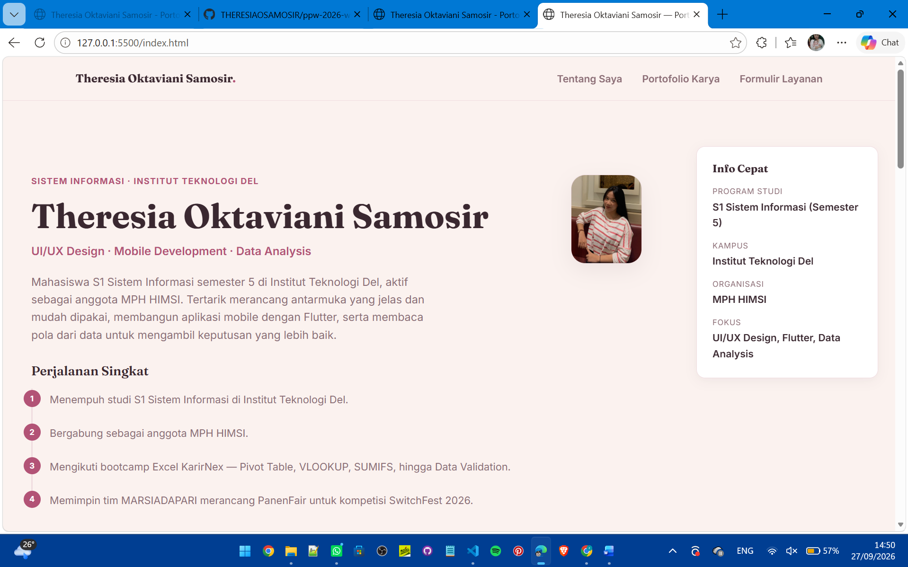
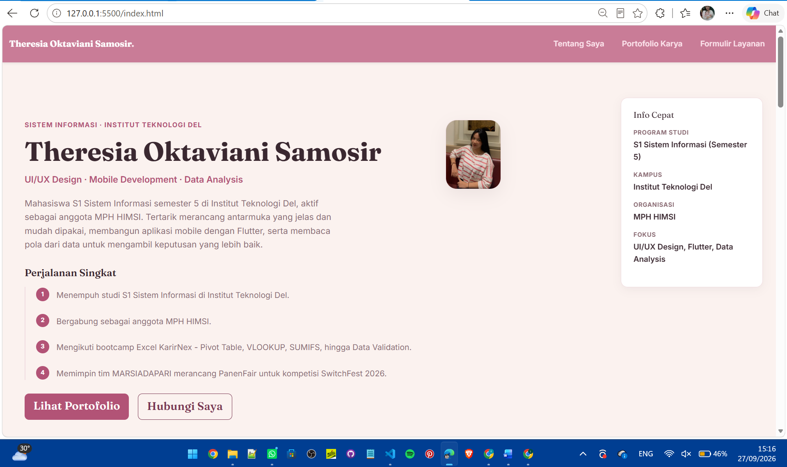
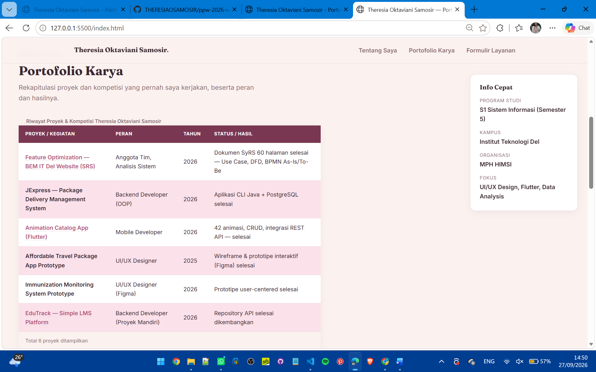
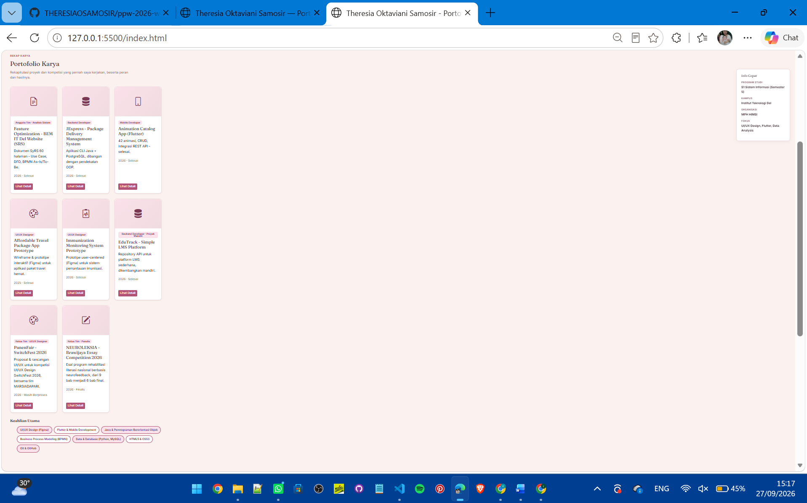
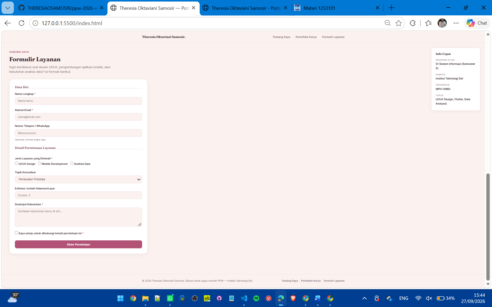
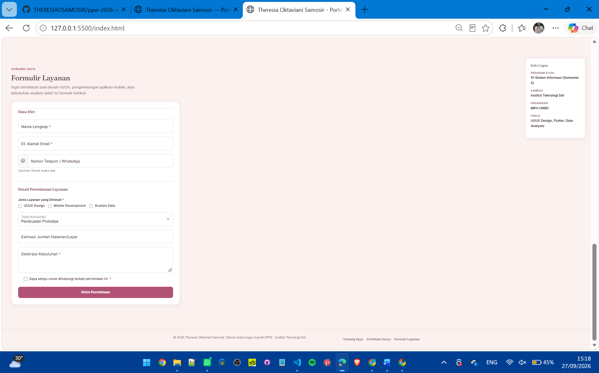

# PPW Portofolio Project - Theresia Oktaviani Samosir

Website portofolio pribadi yang dirancang secara bersih, responsif, dan *accessible* menggunakan **HTML5 Semantic**, **CSS3 Modern**, dan **Bootstrap 5.3**. Proyek ini dibangun sebagai tugas mandiri mata kuliah **Pemrograman dan Pengujian Web (PPW)** Semester 5 tahun 2026 di Institut Teknologi Del.

🌐 **Live Demo:** https://theresiaosamosir.github.io/ppw-2026-week2-12S24055/

---

## Deskripsi

Halaman web portofolio profil profesional tunggal (*single page showcase*) yang menyajikan identitas akademik, rekapitulasi proyek, galeri keahlian, serta formulir konsultasi/kontak. Minggu 2 dibangun dengan HTML5 semantik dan CSS3 murni tanpa framework. Minggu 3 menambahkan Bootstrap 5.3 untuk layout, navbar, modal, dan formulir.

## Fitur Utama

- Struktur semantik HTML5 (`header`, `nav`, `main`, `section`, `aside`, `footer`)
- Tabel data proyek semantik lengkap (`caption`, `thead`, `tbody`, `tfoot`, `scope`)
- Formulir konsultasi accessible dengan `fieldset`, `legend`, `label`, dan validasi native
- Palet warna 60-30-10, tipografi modern (Fraunces + Inter), border-radius, box-shadow
- Layout responsif berbasis CSS Grid, Flexbox, dan Bootstrap 5.3

## 📸 Screenshot Tampilan

### Hero / Tentang Saya
| Sebelum (Week 2) | Sesudah (Week 3) |
|---|---|
|  |  |

### Portofolio
| Sebelum (Week 2) | Sesudah (Week 3) |
|---|---|
|  |  |

### Formulir
| Sebelum (Week 2) | Sesudah (Week 3) |
|---|---|
|  |  |

### Ringkasan Perubahan
| Aspek | Sebelum | Sesudah |
|---|---|---|
| Layout Portofolio | Carousel horizontal manual | Grid Bootstrap 5 (row-cols) |
| Navbar | Statis, tanpa toggle | Responsive, sticky, collapse hamburger |
| Detail Proyek | Tidak ada | Modal Dialog Bootstrap |
| Formulir | Input dasar | Floating Labels + validasi visual |
| CSS Framework | CSS murni | Bootstrap 5.3 + custom overrides |

## Struktur Berkas

```
├── index.html             # Halaman utama portofolio
├── style.css              # Seluruh styling
├── theresia-profile.jpeg  # Foto profil
├── assets/                # Screenshot sebelum dan sesudah
└── README.md              # Dokumentasi ini
```

## Cara Menjalankan Secara Lokal

1. Clone repositori ini
2. Buka folder di VS Code
3. Klik kanan `index.html` lalu pilih **Open with Live Server**

## Dibuat oleh

Theresia Oktaviani Samosir - 12S24055
S1 Sistem Informasi, Institut Teknologi Del